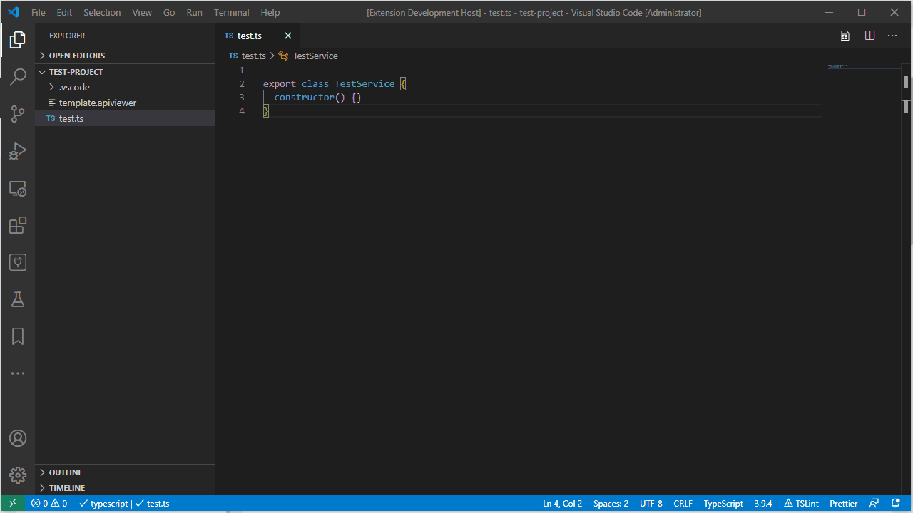
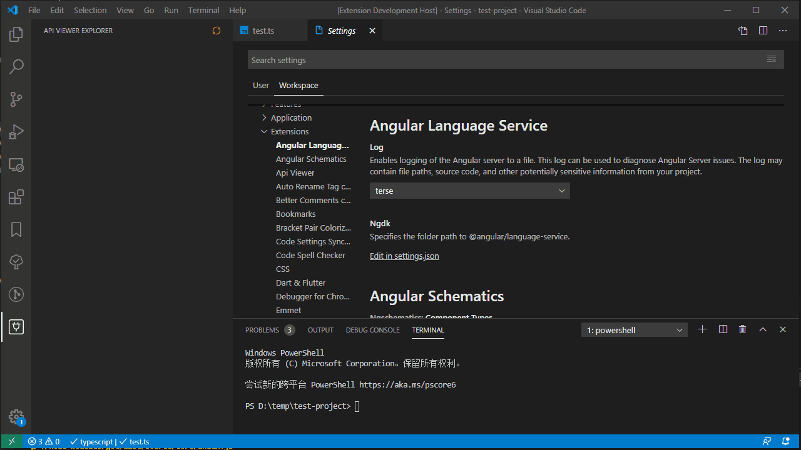

# API Viewer
API Viewer 是一个 VSCode 插件，可以查看 Yapi 或者 swagger(OpenAPI V2)，并且根据文档插入接口请求的 typescript 代码片段。

A VSCode extension for view api docs from Yapi or swagger, and insert request code snippet of typescript. 



## 配置

### **api-viewer.yapi.url**
设置 Yapi 服务器地址

### **api-viewer.yapi.email**
设置登录邮箱

### **api-viewer.yapi.password**
密码

### **api-viewer.yapi.pid**
项目id

### **api-viewer.swagger.url**
swagger json 的地址，填写了 swagger 地址后，插件将使用默认导入 swagger 数据

### **api-viewer.yapi.templateFilePath**
模板文件路径(相对于工作目录)



例子:

```json
{
  "api-viewer.yapi.url": "http://127.0.0.1:3000",
  "api-viewer.yapi.email": "bluehymn@qq.com",
  "api-viewer.yapi.password": "123456",
  "api-viewer.yapi.pid": "11",
}
```

## 输出代码模板语法
输出代码使用 ejs 编译，语法可以可以参考 [ejs 文档](https://github.com/mde/ejs)

模板文件默认路径: ${workspaceFolder}/template.apiviewer

### 模板支持的变量

 * @property {string} method_name 方法名，默认值：requestMethod
 * @property {string} http_method http 方法类型，例如：get, post, delete...
 * @property {string} response_type response 数据类型名, 默认值：ResDataType
 * @property {array} params - 请求接口方法的入参列表，例子：['name', 'age', 'sex']
 * @property {boolean} need_request_body - 接口是否需要 request body
 * @property {string} req_body_type - request body 类型，默认值：ReqBodyType
 * @property {string} res_type - response body 类型，默认值 ResBodyType
 * @property {string} path - 接口路径
 * @property {array} query_params - query 参数列表
 * @property {string} params_str - 已拼接的入参字符串，默认都是 string 类型，例子：'name: string, age: string, sex: string'
 * @property {string} query_params_str - 已拼接的 query 参数，例子：'page=${page}&pageSize=${pageSize}'

### 默认模板
```
  <%= method_name %>(<%= params_str %><% if (need_request_body) { %><% if (params_str) { %>, <% } %>reqBody: <%= req_body_type %><% } %>) {
    return this.http.<%= http_method %><<%= response_type %>>(\`<%= path %><%- query_params_str %>\`<% if (need_request_body) { %>, reqBody <% } %>);
  }

  export const <%= method_name %> = (<%= params_str %><% if (need_request_body) { %><% if (params_str) { %>, <% } %>reqBody: <%= req_body_type %><% } %>) => {
    return http.<%= http_method %><<%= response_type %>>(\`<%= path %><%- query_params_str %>\`<% if (need_request_body) { %>, reqBody <% } %>);
  }
```

### 模板例子
```

---FunctionTemplate
export const <%= method_name %> = (<%= params_str %><% if (need_request_body) { %><% if (params_str) { %>, <% } %>reqBody: <%= req_body_type %><% } %>) => {
    return http.<%= http_method %><<%= response_type %>>(\`<%= path %><%- query_params_str %>\`<% if (need_request_body) { %>, reqBody <% } %>);
  }
---

```
顶部的`---FunctionTemplate` 和 底部的`---` 必须包含


### 输出代码例子
```js
  export class request {
    requestMethod(page: string, pageSize: string, sex: string, name: string) {
      return this.http.get<ResponseDataType>(
        `/admin/user/getUsers?page=${page}&pageSize=${pageSize}&sex=${sex}`
      );
    }
  }
```
&nbsp;

&nbsp;


## Configuration

### **api-viewer.yapi.url**
Set server url of Yapi

### **api-viewer.yapi.email**
Set account of Yapi

### **api-viewer.yapi.password**
Set password of Yapi

### **api-viewer.yapi.pid**
Set id of the Yapi project

### **api-viewer.swagger.url**
Url of swagger json, the Yapi settings will invalid if you set this url

### **api-viewer.yapi.templateFilePath**
Template file path, relative workspace folder

```
http:127.0.0.1:3000/project/{pid}/interface/api/123
```


Example:

```json
{
  "api-viewer.yapi.url": "http://127.0.0.1:3000",
  "api-viewer.yapi.email": "bluehymn@qq.com",
  "api-viewer.yapi.password": "123456",
  "api-viewer.yapi.pid": "11"
}
```

## Change Log

### v0.1.9
1、修复模板 bug

### v0.1.8
1、修复 bugs

### v0.1.7
1、修复 bugs

### v0.1.6
1、接口请求方法支持对象形式入参

### v0.1.5
1、支持导入 swagger(当前仅支持OpenAPI V2)

2、修复 bug

### v0.1.4
1、修复 bug

### v0.1.3
1、支持使用 ejs 模板定义输出代码

2、选择接口请求方法的插入位置

3、修复bug
